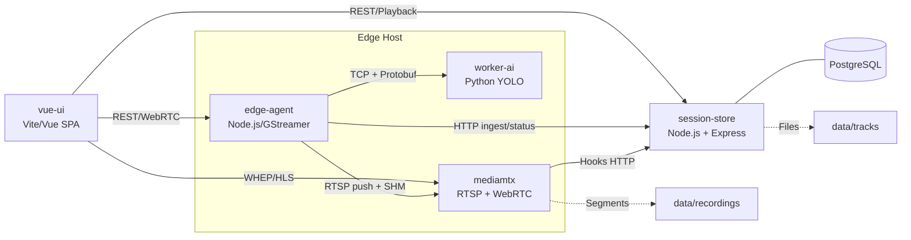
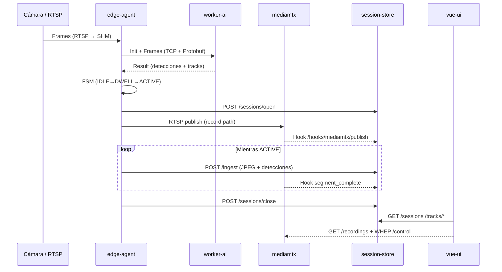
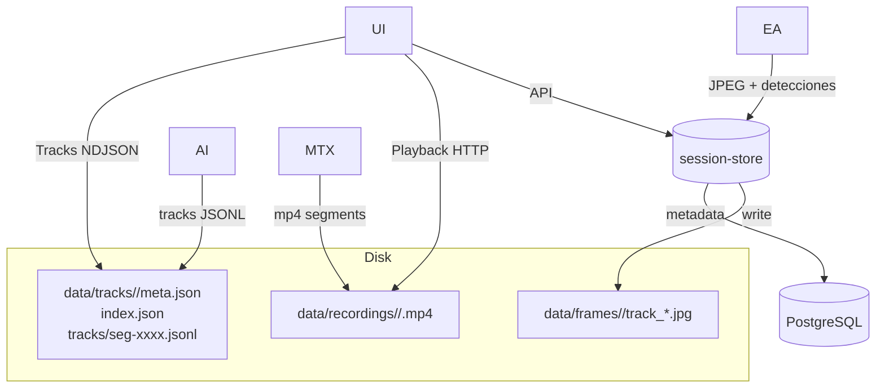
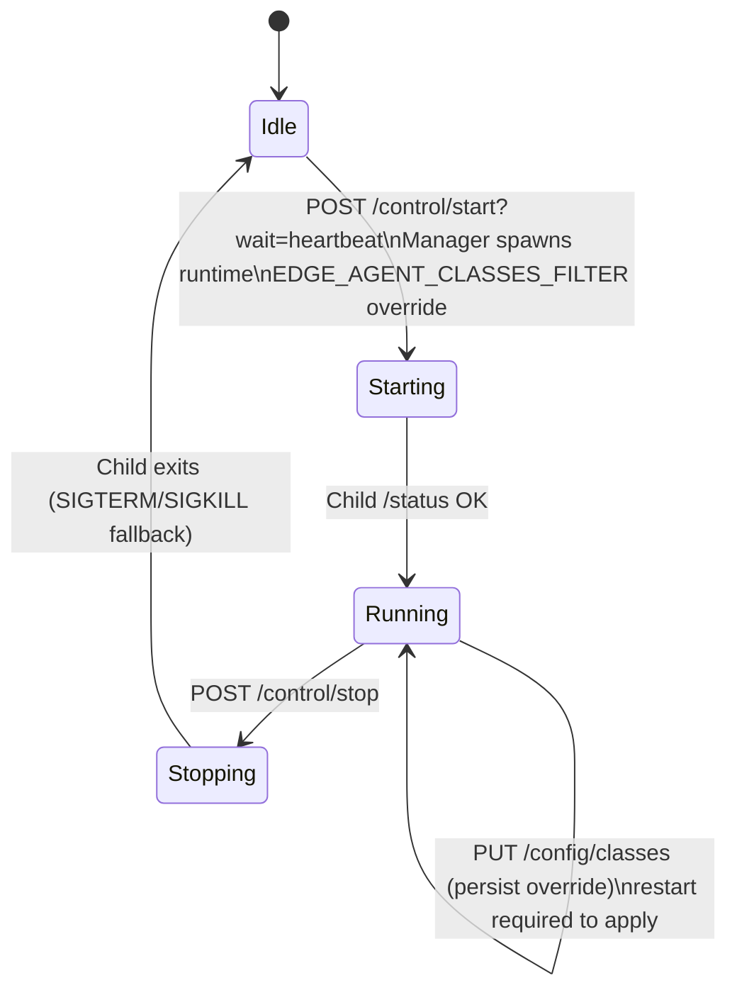

# Arquitecturas Visuales

Referencias rápidas para presentar el sistema end-to-end. Cada diagrama está pensado para ser exportado luego a herramientas visuales (Mermaid → SVG/PNG) y acompañarlo con una breve explicación durante la demo.

---

## 1. Panorama General (Servicios / Contenedores)



**Idea clave**: edge-agent coordina captura/IA/RTSP. worker-ai procesa detecciones. mediamtx guarda segmentos y expone live (WHEP). session-store centraliza sesiones/detecciones y se apoya en PostgreSQL. La UI consume tanto la API como los streams.

---

## 2. Flujo de Detección → Grabación → Catálogo



**Mensajes destacados**:
- `POST /ingest` contiene `meta` + `frame` (JPEG) para timeline UI.
- Hooks informan timestamps y paths exactos de cada segmento MP4.
- La UI reusa `recommended_start_offset_ms` para posicionarse en el clip correcto.

---

## 3. Plano de Datos



**Notas**:
- `data/frames`: evidencias asociadas a detecciones con mayor confianza.
- `data/tracks`: timeline completo por sesión (BoT-SORT) para overlays.
- `data/recordings`: MP4 segmentados (5 min) servidos por la API de MediaMTX.

---

## 4. Control Plane (Supervisor Edge Agent + UI)



**Puntos de conversación**:
- El manager (`npm run dev`) es quien expone la API para la UI (no sirve assets).
- `wait=heartbeat&minFrames=N` garantiza que realmente se están procesando frames antes de dar feedback positivo al usuario.
- Overrides persistidos en `runtime-overrides.json` permiten ajustar clases desde la UI sin editar el TOML.

---

> Para exportar: copiar cada bloque ` ```mermaid ` a https://mermaid.live o VS Code + plugin Mermaid, ajustar estilos corporativos y generar SVG/PNG para la presentación.

---

## 5. Diagramas de bloques (texto)

Para presentaciones o documentos donde no se quiera renderizar Mermaid podés usar estos bloques ASCII.

### 5.1 Panorama general

```
┌────────────┐        RTSP        ┌────────────────────────┐        HTTP/WebRTC        ┌──────────────┐
│Camera/RTSP │───────────────────►│ edge-agent (FSM+GST)   │◄────────────────────────►│   vue-ui     │
└────────────┘                    │  - captura             │                           │ (SPA Vite)   │
                                  │  - IA / worker client │                           └─────┬────────┘
                                  │  - publicación RTSP   │                                 │
                                  └────┬──────────┬───────┘                                 │
                                       │          │                                         │
                                       │ TCP      │ HTTP ingest                             │
                               ┌───────▼───┐  ┌───▼────────────────┐             ┌──────────▼────────┐
                               │ worker-ai │  │ session-store API  │◄───────────►│  MediaMTX (RTSP)  │
                               │ (YOLO)    │  │ + PostgreSQL       │   Hooks     │  + WebRTC/HLS     │
                               └───────────┘  └──────────┬─────────┘             └──────────┬────────┘
                                                         │                               data/recordings
                                              data/tracks│data/frames
```

### 5.2 Flujo detección → grabación → catálogo

```
┌───────┐     SHM/I420      ┌──────────────┐     NV12/TCP     ┌────────┐
│Camera │ ────────────────► │ edge-agent   │ ───────────────► │worker- │
└──┬────┘                   │ - CameraHub  │                  │  ai    │
   │                        │ - NV12Capture│                  └──┬─────┘
   │                        │ - AIFeeder   │                     │ Result (detecciones)
   │                        └────┬─────────┘                     │
   │        Hooks + RTSP         │     Frame + meta              │
   ▼                             ▼          │                    │
┌────────┐   RTSP push   ┌────────────┐     │POST /ingest  ┌─────▼─────────┐      REST/WHEP     ┌──────────────┐
│MediaMTX│◄──────────────│Publisher   │─────┘─────────────►│session-store │◄──────────────────►│   vue-ui     │
└────────┘   MP4/HLS     └────────────┘   close session    │+ PostgreSQL  │   /sessions,tracks │ (catálogo)   │
   ▲                                           ▲           └──────────────┘                    └──────────────┘
   │ segment_complete hooks                    │
   └────────────── (Media ready feedback) ─────┘
```

Pasos clave: captura → detección → apertura de sesión → ingesta (`/ingest`) → grabación MediaMTX → hooks → consumo desde la UI.

### 5.3 Plano de datos

```
┌──────────────┐    multipart    ┌────────────────┐
│ edge-agent   │───────────────►│ session-store   │
│ FrameIngester│                │  API            │
└─────┬────────┘                └──────┬──────────┘
      │ writes JPEGs/metadata         │
      ▼                                ▼
┌──────────────┐               ┌─────────────────┐
│ data/frames  │               │ PostgreSQL      │
│ track_ID.jpg │               │ sessions/detect │
└──────────────┘               └─────────────────┘

┌──────────────┐    NDJSON      ┌──────────────┐
│ worker-ai    │──────────────►│ data/tracks  │
│ SessionWriter│               │ meta/index   │
└──────────────┘               └──────────────┘

┌──────────────┐   MP4 segments ┌────────────────┐
│ MediaMTX     │──────────────► │ data/recordings│
└─────┬────────┘                └────────────────┘
      │ hooks notify path
      ▼
┌──────────────┐
│ session-store│ updates media_* timestamps
└──────────────┘

La UI consume:
  • REST `session-store` (catálogo / tracks meta)
  • `data/recordings` vía MediaMTX playback API
  • `data/tracks/*` para overlays
```
