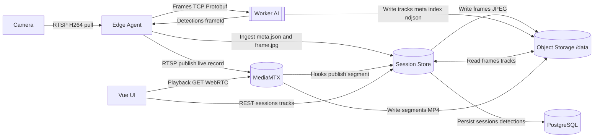

# Arquitectura General del Sistema

Este diagrama resume los componentes principales y los flujos entre captura, inferencia, catálogo y reproducción.

Notas rápidas
- Edge Agent captura desde la cámara, envía frames al Worker AI por TCP/Protobuf y recibe detecciones referenciadas por `frameId`.
- Frame Ingester del Edge envía evidencias a Session Store como multipart: `meta.json` + `frame.jpg`.
- Worker AI escribe artefactos de tracks (meta/index/NDJSON) en Object Storage (/data); Session Store los sirve a la UI.
- MediaMTX recibe el RTSP del Edge (live/record), escribe segmentos MP4 en Object Storage y notifica a Session Store mediante hooks (publish/segment) para fijar `media_*`.
- Vue UI consulta a Session Store para catálogo y overlays, y pide playback a MediaMTX.
