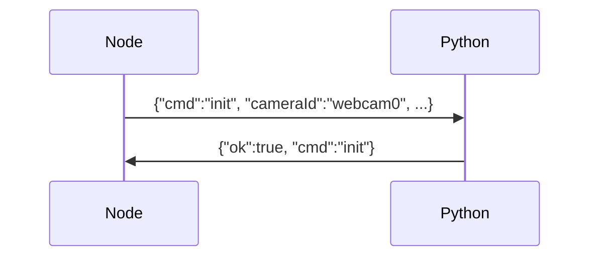
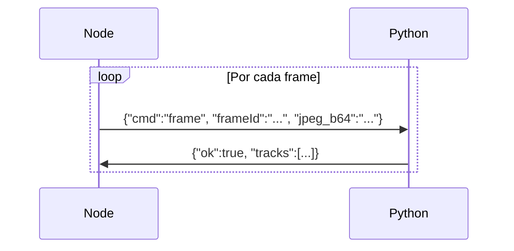
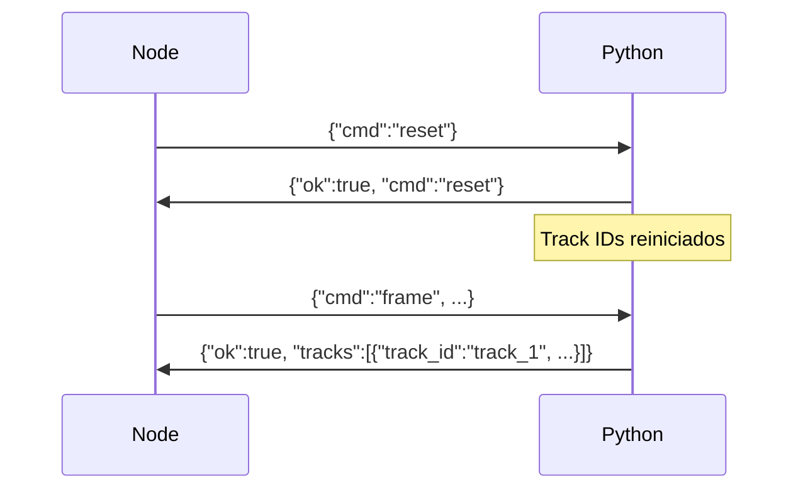

# Protocolo de Comunicación Python ↔ Node.js

## Arquitectura

El servicio Python (`yolo_tracker.py`) se ejecuta como un proceso hijo del wrapper TypeScript (`PythonYOLOTracker`). La comunicación es bidireccional via **NDJSON** (newline-delimited JSON):

- **stdin**: Node → Python (comandos)
- **stdout**: Python → Node (respuestas)
- **stderr**: Python logs (no interferir con stdout)

## Comandos Soportados

### 1. `init` - Inicializar Tracker

**Propósito**: Configurar parámetros de la sesión de tracking antes de procesar frames.

**Formato del comando:**

```json
{
  "cmd": "init",
  "cameraId": "webcam0",
  "threshold": 0.6,
  "classesOfInterest": ["person", "car"],
  "input": {
    "width": 640,
    "height": 640
  }
}
```

**Campos:**

- `cmd`: `"init"` (requerido)
- `cameraId`: Identificador de la cámara (string)
- `threshold`: Umbral de confianza mínimo (0.0 - 1.0)
- `classesOfInterest`: Array de clases a detectar
- `input`: Dimensiones esperadas del input del modelo

**Respuesta:**

```json
{
  "ok": true,
  "cmd": "init",
  "message": "Tracker initialized"
}
```

**Errores:**

```json
{
  "ok": false,
  "cmd": "init",
  "error": "Error message"
}
```

---

### 2. `frame` - Procesar Frame

**Propósito**: Ejecutar detección y tracking en un frame.

**Formato del comando:**

```json
{
  "cmd": "frame",
  "frameId": "uuid-1234-5678-90ab",
  "ts": 1696440000123,
  "width": 1280,
  "height": 720,
  "jpeg_b64": "<base64-encoded-jpeg-data>"
}
```

**Campos:**

- `cmd`: `"frame"` (requerido)
- `frameId`: UUID único del frame (opcional, para correlación)
- `ts`: Timestamp epoch en milisegundos
- `width`: Ancho del frame original
- `height`: Alto del frame original
- `jpeg_b64`: Frame codificado en JPEG y luego base64

**Respuesta:**

```json
{
  "ok": true,
  "frameId": "uuid-1234-5678-90ab",
  "ts": 1696440000123,
  "width": 1280,
  "height": 720,
  "tracks": [
    {
      "track_id": "track_1",
      "label": "person",
      "bbox_xywh_norm": [0.1234, 0.2345, 0.3456, 0.6789],
      "score": 0.93
    },
    {
      "track_id": "track_2",
      "label": "person",
      "bbox_xywh_norm": [0.5678, 0.3456, 0.2345, 0.5678],
      "score": 0.88
    }
  ]
}
```

**Campos de respuesta:**

- `ok`: `true` si éxito, `false` si error
- `frameId`: Mismo UUID del comando (si se proporcionó)
- `ts`: Timestamp del frame procesado
- `width`, `height`: Dimensiones del frame
- `tracks`: Array de objetos detectados con tracking

**Estructura de `track`:**

- `track_id`: ID único del track (ej: `"track_1"`, `"track_2"`, etc.)
  - **Importante**: Los IDs son persistentes mientras el tracker esté activo
  - Se reinician con el comando `reset`
- `label`: Clase detectada (string, ej: `"person"`)
- `bbox_xywh_norm`: Bounding box normalizada [0..1] en formato `[x, y, w, h]`
  - `x`: Coordenada X del centro normalizada
  - `y`: Coordenada Y del centro normalizada
  - `w`: Ancho normalizado
  - `h`: Alto normalizado
- `score`: Confianza de la detección (0.0 - 1.0)

**Errores:**

```json
{
  "success": false,
  "error": "Error message",
  "detections": []
}
```

---

### 3. `reset` - Resetear Estado del Tracker

**Propósito**: Limpiar el estado interno de ByteTrack, reiniciando los track IDs.

**Formato del comando:**

```json
{
  "cmd": "reset"
}
```

**Respuesta:**

```json
{
  "ok": true,
  "cmd": "reset",
  "message": "Tracker state reset"
}
```

**Comportamiento:**

- Reinicia el modelo YOLOv8 (nueva instancia)
- Los track IDs empiezan desde `track_1` nuevamente
- Se ejecuta automáticamente al rotar sesiones (cada 30s)

**Errores:**

```json
{
  "ok": false,
  "cmd": "reset",
  "error": "Error message"
}
```

---

## Flujo de Trabajo Típico

### 1. Inicio de Sesión



### 2. Procesamiento de Frames



### 3. Rotación de Sesión (cada 30s)



---

## Implementación en Python

### Estructura del Script

```python
class YOLOTracker:
    def __init__(self, model_path, tracker_config):
        self.model = YOLO(model_path)
        self.tracker_config = tracker_config

    def reset(self):
        """Resetear estado del tracker"""
        self.model = YOLO(self.model_path)

    def process_frame(self, frame_data):
        """Procesar frame y retornar detections con tracking"""
        # 1. Decodificar imagen desde base64
        # 2. Ejecutar model.track(...)
        # 3. Extraer bbox, classes, scores, track_ids
        # 4. Retornar resultado
```

### Main Loop

```python
def main():
    tracker = YOLOTracker(model_path, config)

    for line in sys.stdin:
        message = json.loads(line)
        cmd = message.get('cmd', 'frame')

        if cmd == 'init':
            # Configurar parámetros
            response = {"ok": True, "cmd": "init"}

        elif cmd == 'frame':
            # Procesar frame
            result = tracker.process_frame(message)
            response = result

        elif cmd == 'reset':
            # Resetear tracker
            tracker.reset()
            response = {"ok": True, "cmd": "reset"}

        print(json.dumps(response), flush=True)
```

---

## Implementación en TypeScript

### PythonYOLOTracker Class

```typescript
class PythonYOLOTracker {
  async start(): Promise<void> {
    // Spawn Python process
    this.process = spawn('python3', [script_path, args...])

    // Handle stdout (responses)
    this.process.stdout.on('data', (data) => {
      // Parse NDJSON
      // Resolve pending promises
    })
  }

  async init(cameraId, threshold, classes): Promise<void> {
    const cmd = {cmd: 'init', cameraId, threshold, classesOfInterest: classes}
    return this.sendCommand(cmd)
  }

  async detect(frame: Frame): Promise<Detection[]> {
    const cmd = {cmd: 'frame', frameId: uuid(), jpeg_b64: base64}
    return this.sendCommand(cmd)
  }

  async reset(): Promise<void> {
    const cmd = {cmd: 'reset'}
    return this.sendCommand(cmd)
  }
}
```

---

## Consideraciones de Rendimiento

### Latencia Objetivo

- Procesamiento por frame: < 100ms (modelo yolov8n/s)
- Total end-to-end: < 150ms

### Optimizaciones

1. **Compresión JPEG**: Calidad 80-90% (balance tamaño/calidad)
2. **Resolución**: 640x640 para YOLOv8 (ajustable)
3. **FPS**: 5-10 FPS recomendado para Edge
4. **Buffer**: Limitar keyframes a últimos 100 por track

### Limitaciones

- NDJSON + base64 JPEG: Overhead ~33% vs raw bytes
- Alternativas para alta frecuencia: gRPC, ZeroMQ, shared memory

---

## Manejo de Errores

### Python Side

- Logs a **stderr** (no stdout)
- Respuestas con `{"ok": false, "error": "..."}` en stdout
- No terminar el proceso en errores recuperables

### TypeScript Side

- Timeouts por comando (5-10s)
- Reinicio automático del proceso Python si crash
- Queue de requests con backpressure

---

## Testing

### Test del Protocolo

```bash
# Terminal 1: Start Python service
cd python
source .venv/bin/activate
python yolo_tracker.py --model ../models/yolov8s.pt

# Terminal 2: Send test commands
echo '{"cmd":"init","cameraId":"test","threshold":0.6,"classesOfInterest":["person"]}' | python yolo_tracker.py --model ../models/yolov8s.pt
```

### Test End-to-End

Ver tests en `packages/detector/src/__tests__/python-tracker.test.ts`

---

## Changelog

| Versión | Fecha      | Cambios                                |
| ------- | ---------- | -------------------------------------- |
| 1.0.0   | 2025-10-04 | Protocolo inicial con init/frame/reset |

---

**Última actualización**: 4 de octubre de 2025
