# Edge Agent – Arquitectura y Flujos

Documentación detallada del servicio que corre en el borde, incluyendo módulos, interacción con el resto del sistema y pipelines de GStreamer. Todos los diagramas están en formato Mermaid para que puedan exportarse a la presentación.

---

## 1. Visión General

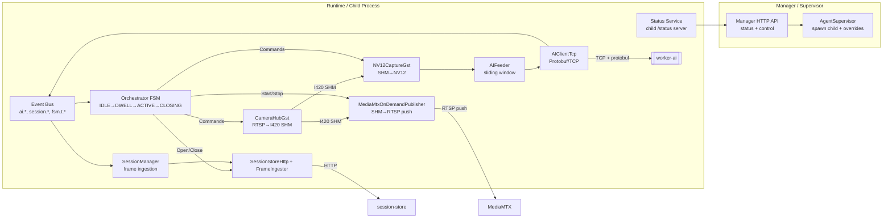

**Idea clave**: El manager (process padre) expone la API utilizada por la UI para iniciar/detener el agente y administrar overrides (clases). El runtime (process hijo) contiene los módulos de captura, IA, streaming y FSM. La comunicación con worker-ai se hace vía TCP + Protobuf; la persistencia de sesiones/detecciones se hace vía HTTP hacia `session-store`.

---

## 2. Módulos principales

| Módulo | Rol | Implementación |
| --- | --- | --- |
| **Manager HTTP** | Expone `/status`, `/control/start`, `/control/stop`, `/config/classes`. Persiste overrides en `runtime-overrides.json` y lanza el runtime como child process. | `src/manager/*` |
| **CameraHubGst** | Pipeline GStreamer que convierte RTSP/H.264 a I420 y publica el resultado en un socket SHM compartido. | `src/modules/video/adapters/gstreamer/camera-hub-gst.ts` |
| **NV12CaptureGst** | Toma la alimentación I420 del hub, la convierte a NV12 (o I420) y entrega frames listos para IA. | `src/modules/video/adapters/gstreamer/nv12-capture-gst.ts` |
| **AIFeeder + AIClientTcp** | Coordina el envío de frames al worker (ventana deslizante LATEST_WINS, cache para correlación) y maneja el protocolo TCP/Protobuf. | `src/modules/ai/feeder` + `src/modules/ai/client` |
| **FrameCache + SessionManager + FrameIngester** | Correlan detecciones con frames NV12, generan JPEGs y suben metadatos al `session-store` mediante multipart (`/ingest`). | `src/modules/ai/cache`, `src/app/session.ts`, `src/modules/ai/ingest/frame-ingester.ts` |
| **MediaMtxOnDemandPublisher** | Lee desde el hub SHM y publica RTSP (H.264) hacia MediaMTX solo cuando la FSM lo requiere (ACTIVE/CLOSING). | `src/modules/streaming/adapters/gstreamer/media-mtx-on-demand-publisher-gst.ts` |
| **Orchestrator + Bus + Timers** | FSM pura que recibe eventos (`ai.detection`, timers `fsm.t.*`) y emite comandos (`StartStream`, `OpenSession`, etc.). | `src/core/bus`, `src/core/orchestrator` |

---

## 3. Flujo End-to-End

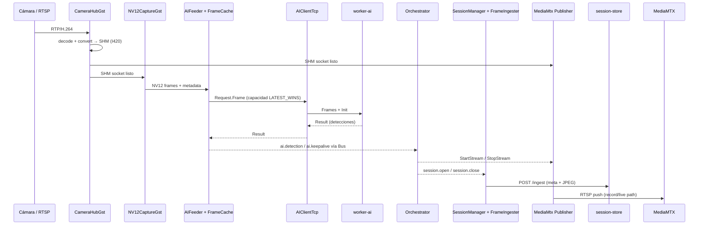

---

## 4. Máquina de Estados

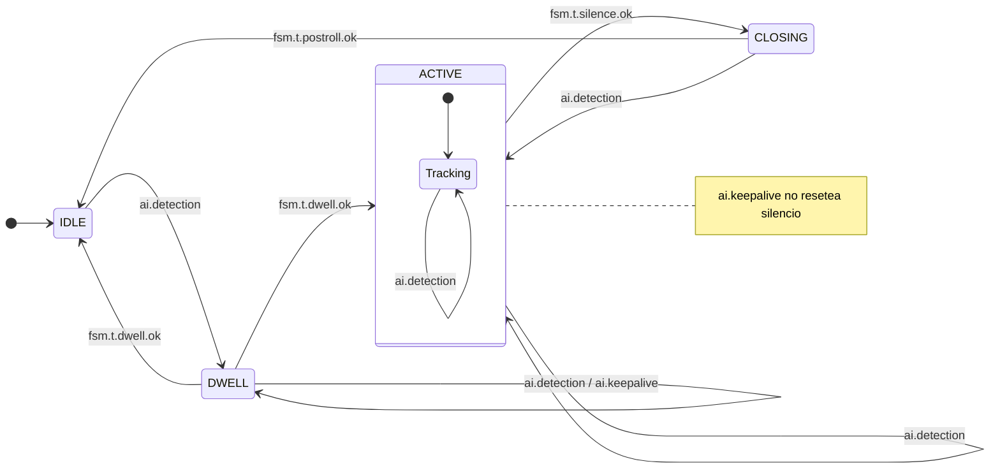

Comandos disparados por transición:

- **DWELL → ACTIVE**: `StartStream(record)`, `OpenSession`, `SetAIFpsMode('active')`
- **ACTIVE → CLOSING**: `SetAIFpsMode('idle')`
- **CLOSING → IDLE**: `StopStream`, `CloseSession`

`ai.keepalive` no resetea el timer de silencio; sólo las detecciones relevantes (post filtrado) lo hacen.

---

## 5. Pipelines de GStreamer

### 5.1 Ingesta (CameraHubGst)

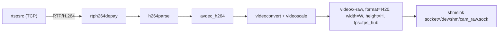

#### Versión simplificada (slides)

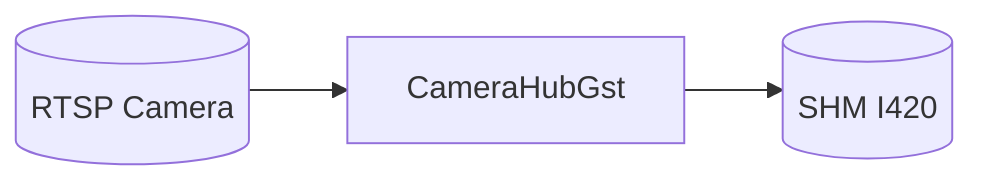

Comentario: Resume la idea “Cámara RTSP → Hub → SHM compartido”, ideal para explicar que desde este punto nacen todos los consumidores sin entrar en detalles de GStreamer.

### 5.2 Captura IA (NV12CaptureGst)

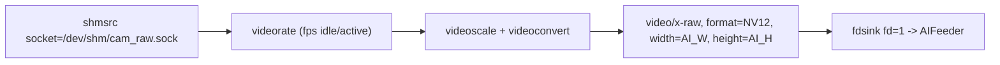

#### Versión simplificada (slides)

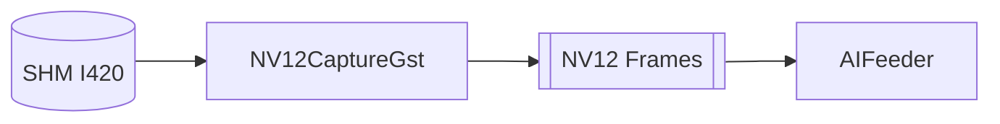

Comentario: Destaca que el módulo solo lee del socket SHM y escupe NV12 directo al feeder/IA, dejando claro el flujo sin cap negotiation ni capsfilters.

### 5.3 Publicación RTSP (MediaMtx Publisher)

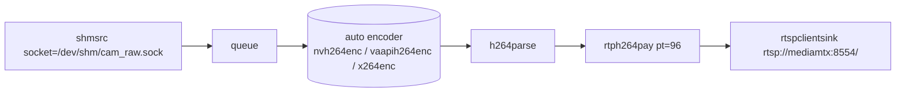

#### Versión simplificada (slides)

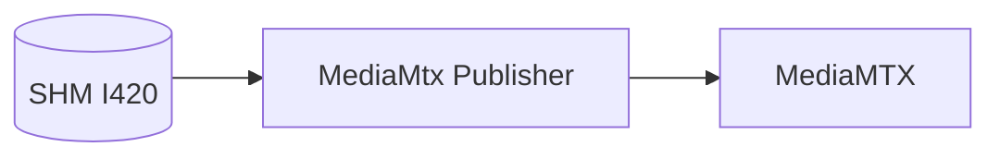

Comentario: Deja evidente que el publisher reutiliza el SHM para empujar RTSP a MediaMTX, diferenciando los paths record/live sin profundizar en la tubería completa.

Cada pipeline corre en su propio proceso `gst-launch-1.0` administrado por `spawnProcess`, con reinicios automáticos en caso de fallo (CameraHub) y arranques bajo demanda (Publisher).

---

## 6. Bus de Eventos y SessionManager

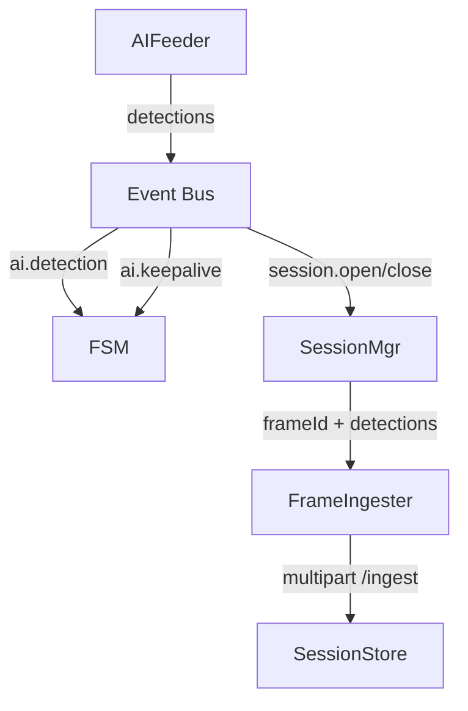

- **FrameCache** guarda los frames NV12 durante ~2 segundos para que el `SessionManager` pueda recuperar el buffer cuando el worker responde.
- **FrameIngester** convierte NV12→JPEG y empaqueta `meta.json + frame.jpg` en un POST multipart hacia `/ingest`.

---

## 7. Configuración

El archivo `services/edge-agent/config.toml` es la única fuente de verdad. Secciones relevantes:

- `[source]`: RTSP URI, resolución, `fps_hub`, `socket_path`, `shm_size_mb`.
- `[ai]`: modelo (`/models/…`), filtros de clases, fps idle/active, host/puerto del worker.
- `[mediamtx]`: `host`, `port`, `record_path`, `live_path`.
- `[fsm]`: timers `dwell_ms`, `silence_ms`, `postroll_ms`.
- `[store]`: `base_url` del session-store.
- `[status]`: puerto del manager y del runtime (`port + 1`).

Overrides rápidos disponibles vía entorno:

| Variable | Efecto |
| --- | --- |
| `EDGE_AGENT_AUTOSTART=true` | El manager inicia automáticamente el runtime al boot. |
| `EDGE_AGENT_CLASSES_FILTER="person,car"` | Override temporal sin editar el TOML (persistido si se hace via `/config/classes`). |
| `EDGE_AGENT_STATUS_PORT=7080` | Cambia el puerto donde expone la API el runtime standalone. |
| `EDGE_AGENT_CHILD_STATUS_PORT=7081` | Forzar el puerto usado para `/status` interno cuando corre detrás del manager. |

---

## 8. Referencias cruzadas

- Eventos del bus: `docs/EVENTS.md`
- Protocolo TCP v1: `docs/PROTOCOL_V1.md`
- Operaciones y endpoints del manager: `docs/OPERATIONS.md`
- Diagramas del sistema completo: `../../docs/ARCHITECTURE_DIAGRAMS.md`

> Sugerencia: copiar los bloques Mermaid a https://mermaid.live para exportar las imágenes finales que se van a usar en la presentación del sistema.

---

## 9. Diagramas de bloques (texto)

Diagramas ASCII pensados para slides o documentos donde no se quiera renderizar Mermaid. Podés pegar estos bloques tal cual o adaptarlos rápidamente.

### 9.1 Vista de servicios y dependencias

```
                                    ┌─────────────────────────────┐
                                    │        vue-ui (SPA)         │
                                    └──────┬──────────────────────┘
                                           │ REST + WebRTC
                                           │
┌──────────────────────┐       ┌───────────▼─────────────┐       ┌────────────────────────────┐
│  Edge Agent Manager  │<─────►│ Edge Agent Runtime      │──────►│ MediaMTX (RTSP/WHEP)       │
│  /config /status     │       │ (FSM + GStreamer + IA)  │       │ 8554 / 8889 / 9996         │
└──────────┬───────────┘       └───────────┬─────────────┘       └──────────┬────────────────┘
           │                               │                                  │ hooks
           │                               │ HTTP /ingest                     │
           │                               ▼                                  ▼
           │                       ┌────────────────────┐            ┌───────────────────────┐
           │                       │ Session Store API  │◄───────────│ Hooks publish/segment │
           │                       │ + PostgreSQL       │            └──────────┬────────────┘
           │                       └─────────┬──────────┘                       │
           │                                 │                                  │ data/recordings
           │                                 │ data/tracks / frames             │
           ▼                                 ▼                                  ▼
   runtime-overrides.json         data/frames & data/tracks            data/recordings
```

### 9.2 Módulos internos (runtime)

```
┌────────────────────────────────────────────────────────────────────────────────────────────┐
│                                Edge Agent Runtime                                          │
│                                                                                            │
│  ┌──────────────┐      ┌────────────────────────────────────────────┐                      │
│  │ CameraHubGst │─────►│ /dev/shm/cam_raw.sock (I420 fan-out SHM)   │                      │
│  │ (RTSP→I420)  │      └───────────┬──────────────┬─────────────────┘                      │
│  └────┬─────────┘                  │              │                                        │
│       │ Start/Stop capture         │              │ Start/Stop stream                      │
│       ▼                            ▼              ▼                                        │
│  ┌──────────────┐          ┌────────────┐   ┌────────────┐                                  │
│  │ NV12Capture  │          │ Live Pub   │   │ Record Pub │   (dos pipelines SHM→RTSP)      │
│  │ (I420→NV12)  │          │ (live path)│   │ (record path)                                │
│  └────┬─────────┘          └────┬───────┘   └────┬───────┘                                  │
│       │ NV12 frames + meta           │            │                                        │
│       ▼                              │            │                                        │
│  ┌──────────────────────┐    comandos ◄┴──────────┴──────────────┐                         │
│  │ AIFeeder + FrameCache│─── ai.* / session.* events ─┐          │                         │
│  │ (backpressure + TTL) │                              │          │                         │
│  └──────┬───────────────┘                              ▼          │                         │
│         │ Frames & results via TCP        ┌────────────────────┐  │                         │
│         ▼                                 │ Event Bus          │◄─┘                         │
│  ┌──────────────────────┐                 │ (ai.*, session.*,  │                            │
│  │ AIClientTcp          │──────────────► Worker-AI (TCP/Proto) │                            │
│  │ (TCP + protobuf)     │◄────────────── detecciones + keepalive│                            │
│  └─────────┬────────────┘                 └──────┬──────────────┘                            │
│            │ resultados + sessionId               │                                           │
│            ▼                                      ▼                                           │
│  ┌──────────────────────┐                 ┌──────────────────────┐                           │
│  │ SessionManager       │◄── session.* ──►│ Orchestrator + FSM   │                           │
│  │ + FrameCache access  │                 │ (timers & commands)  │                           │
│  └──────┬───────────────┘                 └──────┬───────────────┘                           │
│         │ frames + detecciones                   │ Start/StopStream / SetAIFps / Open/Close  │
│         ▼                                        ▼                                           │
│  ┌──────────────────────┐                ┌──────────────────────┐                            │
│  │ FrameIngester        │───────────────►│ session-store API    │ (/ingest + /sessions)      │
│  │ (NV12→JPEG + POST)   │                └──────────────────────┘                            │
│  └──────────────────────┘                                                                    │
│                                                                                            │
└────────────────────────────────────────────────────────────────────────────────────────────┘
```

#### Versión simplificada (slides)

```
Cámara RTSP
    │
    ▼
CameraHubGst ──► SHM I420 ──┬──────────────► MediaMtx Publisher (live/record)
                            │
                            ▼
                      NV12Capture ──► AIFeeder/FrameCache ──► AIClientTcp ──► worker-ai
                                                        detecciones │
                                                                     ├─► Bus / Orchestrator (FSM)
                                                                     └─► SessionManager ──► FrameIngester ──► session-store
```

Rama detecciones: los resultados del worker se bifurcan directamente desde `AIClientTcp`; el Orchestrator recibe eventos (`ai.detection`, `ai.keepalive`) vía bus para manejar estados/comandos, mientras que el SessionManager toma el `frameId`, busca el frame en cache y, junto con FrameIngester, sube la evidencia al `session-store`.

Explicación rápida:
- Todo parte de una sola decodificación RTSP: `CameraHubGst` convierte a I420 y lo publica en `/dev/shm/cam_raw.sock`, permitiendo múltiples lectores sin copiar memoria.
- Desde el SHM salen dos rutas:
  - **Streaming**: un publisher live siempre encendido empuja RTSP a MediaMTX; el publisher record se arranca/baja desde la FSM sólo cuando hay una sesión ACTIVE/CLOSING.
  - **IA**: `NV12CaptureGst` toma el SHM, baja resolución/FPS según modo, convierte a NV12 y alimenta al AIFeeder + AIClient que envían frames al `worker-ai` por TCP/Protobuf.
- Cuando vuelven detecciones, `AIClientTcp` entrega el resultado a dos consumidores:
  - **Bus/Orchestrator**: publica `ai.detection`/`ai.keepalive` para que la FSM maneje timers, comandos (`StartStream(record)`, `Open/CloseSession`, `SetAIFpsMode`) y cambios de estado.
  - **SessionManager + FrameIngester**: con el `frameId` recuperan el frame NV12 del cache, generan el JPEG y suben `meta.json + frame.jpg` al `session-store` vía `/ingest`.
- Con este fan-out temático (streaming siempre listo + IA on-demand) el agent puede detectar, abrir sesiones, grabar segmentos y proveer live view sin duplicar pipelines ni redecodificar la cámara.

#### Orchestrator (slides)

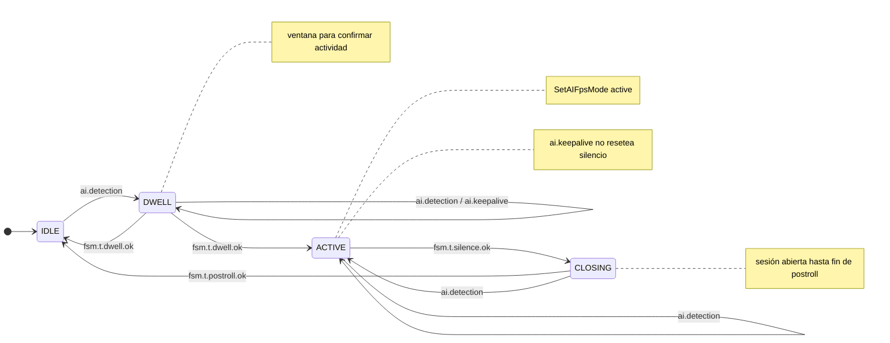

- **Inicio**: una vez que el runtime inicializa cámaras, AI y publishers, el Orchestrator se crea, se suscribe al bus (`ai.*`, `session.*`, `fsm.t.*`) y queda en `IDLE` esperando la primera detección para armar la ventana de DWELL.
- **DWELL → ACTIVE**: al vencer `fsm.t.dwell.ok` después de una detección relevante, dispara `StartStream(record)` (arranca el publisher on-demand), envía `OpenSession` al session-store y ordena `SetAIFpsMode('active')` para subir el throughput de IA.
- **ACTIVE → CLOSING**: si el temporizador de silencio expira sin detecciones importantes, baja la IA a modo idle (`SetAIFpsMode('idle')`), inicia el post-roll y mantiene la sesión abierta mientras el publisher record sigue enviando RTSP.
- **CLOSING → IDLE**: cuando el post-roll concluye, ejecuta `StopStream` y `CloseSession`; si durante CLOSING llega una detección relevante, el flujo salta nuevamente a `ACTIVE` para no perder actividad.
- **Eventos auxiliares**: consume `session.open/close` para almacenar/eliminar el `sessionId` real devuelto por el store, y cada `ai.detection` relevante reinicia los timers de DWELL/Silence, garantizando que sólo haya una sesión activa por vez pero sin cortar escenas a mitad de camino.

### 9.3 Pipelines GStreamer (texto)

**CameraHubGst (RTSP → SHM I420)**
```
┌────────┐   ┌────────────┐   ┌────────┐   ┌──────────────┐   ┌────────────────────┐   ┌─────────────┐   ┌────────────────────────────┐
│ rtspsrc│--►│rtph264depay│--►│h264parse│--►│avdec_h264     │--►│videoconvert+videoscale│--►│video/x-raw,I420│--►│shmsink /dev/shm/cam_raw.sock │
│ (tcp)  │   │            │   │        │   │ (decode H.264)│   │ (ajusta formato)    │   │ width=W      │   │ (socket compartido)        │
└────────┘   └────────────┘   └────────┘   └──────────────┘   └────────────────────┘   │ height=H     │   └────────────────────────────┘
                                                                                       │ fps=fps_hub  │
                                                                                       └─────────────┘
```

**NV12CaptureGst (SHM → NV12 para IA)**
```
┌────────────────────────────┐   ┌──────────────┐   ┌────────────────────┐   ┌──────────────────────────────┐   ┌────────────────────────────┐
│shmsrc /dev/shm/cam_raw.sock│--►│videorate     │--►│videoscale+convert  │--►│video/x-raw,NV12,width=AI_W   │--►│fdsink fd=1 (hacia AIFeeder)│
│(lee I420 del hub)          │   │(idle/active) │   │(ajusta tamaño)     │   │height=AI_H, fps configurado │   │ (pipe NV12)                │
└────────────────────────────┘   └──────────────┘   └────────────────────┘   └──────────────────────────────┘   └────────────────────────────┘
```

**MediaMtx Publisher (SHM → RTSP)**
```
┌────────────────────────────┐   ┌────────┐   ┌──────────────────────────────┐   ┌────────┐   ┌────────────┐   ┌─────────────────────────────────────┐
│shmsrc /dev/shm/cam_raw.sock│--►│ queue  │--►│{nvh264enc|vaapih264enc|x264enc}│--►│h264parse│--►│rtph264pay│--►│rtspclientsink rtsp://mediamtx:8554/...│
│(I420 compartido)           │   │(buffer)│   │(encoder auto HW/SW)           │   │        │   │ pt=96     │   │  record_path o live_path             │
└────────────────────────────┘   └────────┘   └──────────────────────────────┘   └────────┘   └────────────┘   └─────────────────────────────────────┘
```
