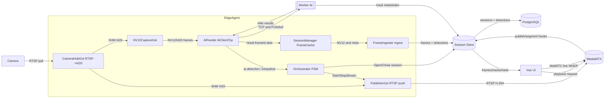
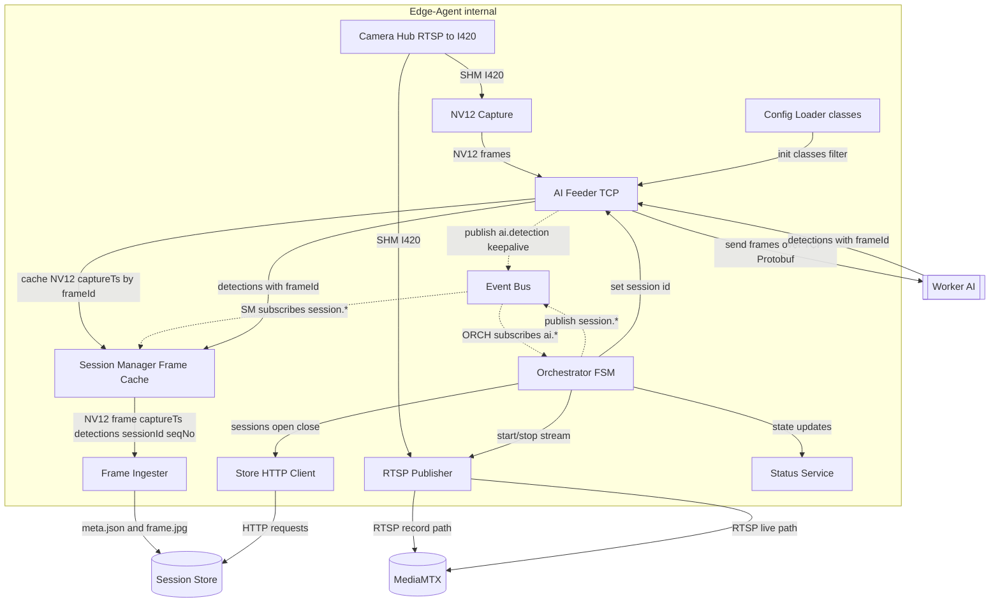

# Arquitectura Visual

Diagrama simplificado y alineado con la implementación actual.

Notas

- Edge-Agent encapsula captura (CameraHub/NV12Capture), inferencia (AIFeeder + AIClientTcp) y control (Orchestrator + FrameIngester). Cada módulo aparece como bloque dentro del subgrafo.
- El Orchestrator es el único que emite comandos de streaming y sesiones; los eventos `ai.detection/keepalive` llegan desde AIFeeder tras procesar la respuesta del Worker.
- Session-Store persiste todo (PostgreSQL + archivos) y también recibe los hooks de MediaMTX para guardar `media_*` timestamps antes de exponerlos a la UI.

## Edge-Agent (interno)

